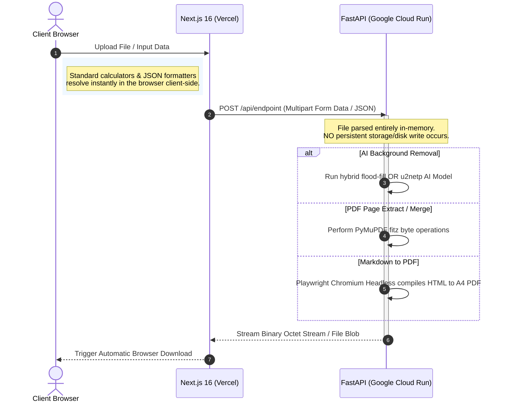

# The Utilify (www.theutilify.com)

[](https://www.theutilify.com)
[](https://www.theutilify.com)
[](https://github.com/vaibhavdeshmukhdeveloper/the-utilify)
[](https://github.com/vaibhavdeshmukhdeveloper/the-utilify)

Welcome to **The Utilify** — a professional-grade, privacy-first, and completely free online suite of utility and productivity tools. The application is live at **[theutilify.com](https://www.theutilify.com/)** and is engineered from the ground up to offer lightning-fast, high-fidelity operations without the bloat, ads, or premium subscriptions of traditional file converters.

This repository hosts the complete codebase, comprising a high-performance **Next.js 16 (App Router)** frontend and an optimized **FastAPI (Python 3.11)** microservices backend. Both services are hooked to automatic Git-based deployment workflows: the frontend is auto-deployed to **Vercel**, and the backend is containerized and auto-deployed to **Google Cloud** on every push to the `main` branch.

---

## 🌟 Key Features & Tools

The Utilify is organized into clear, focused categories. Each tool is designed to work client-side where possible, falling back to secure, transient cloud computation only when heavy AI or headless browser-level rendering is required.

### 🖼️ Image Utilities
*   **AI Background Remover (`/background-remover`):** Automatically isolates subjects and removes complex backgrounds in milliseconds.
    *   *Hybrid Engine:* Employs a fast mathematical flood-fill algorithm for flat graphic and vector backgrounds, and instantly falls back to a **u2netp** neural network model for photographs.
*   **Image Compressor (`/image-compressor`):** Compresses and optimizes image formats (PNG, JPG, WebP) directly in the browser with zero quality loss.

### 📄 PDF Utilities
*   **PDF to Image (`/pdf-to-image`):** Converts PDF document pages into individual high-resolution PNG images packed inside a structured `.zip` file using **PyMuPDF (fitz)** rendered at `2x` resolution (~150 DPI).
*   **Split PDF (`/split-pdf`):** Extracts specific pages, ranges, or custom indices (e.g. `1-3, 5, 8-10`) into separate, lightweight PDF files.
*   **Merge PDF (`/merge-pdf`):** Sequentially combines multiple PDF documents of any size into a single, perfectly formatted file.
*   **Markdown to PDF (`/markdown-to-pdf`):** Converts styled markdown files or raw strings directly into beautiful, custom-styled A4 PDF files. Uses a headless Playwright Chromium instance for pixel-perfect browser-level rendering.

### 📈 Financial Calculators
*   **SIP Calculator (`/sip-calculator`):** Projects compound returns and maturity wealth for monthly Systematic Investment Plans (SIPs) in mutual funds. Includes visual projections.
*   **Investment Calculator (`/investment-calculator`):** Models long-term wealth growth under custom initial capital, recurring contributions, compound intervals, and rate of return assumptions.

### 🩺 Health & Developer Tools
*   **BMI Calculator (`/bmi-calculator`):** Instantly calculates Body Mass Index and provides interactive categorizations and healthy weight suggestions.
*   **JSON Formatter (`/json-formatter`):** Prettifies, validates, minifies, and syntax-highlights raw JSON data in real-time.

---

## 🛡️ Architecture & Philosophy

The Utilify operates under a strict **privacy-first schema**. 

1.  **Zero Storage Retention:** Neither the frontend nor the backend databases store user-uploaded images or PDFs. Files are processed transiently in-memory on our secure API servers and are deleted immediately after streaming the binary response back to the client.
2.  **Edge Decoupling:** General layout, local configurations, routing, formatting, and calculators execute purely inside the client's web browser, maximizing responsiveness and lowering server loads.
3.  **Dockerized Backend Pipelines:** Computationally intensive tasks (ONNX runtime AI inferences, PDF manipulation, and Chromium rendering) run on a scale-to-zero Dockerized microservices stack deployed on Google Cloud.



---

## 🛠️ Tech Stack & Dependencies

### Frontend (`/src`)
*   **Framework:** Next.js 16 (React 19 & TypeScript)
*   **Styling:** Tailwind CSS v4 (Modern HSL colors, premium custom variables, clean dark/light mode system)
*   **Theme Control:** `next-themes` (Sleek glassmorphism navigation and responsive elements)
*   **Components:** Base UI, Lucide React (Icons), `react-dropzone` (File Upload), Shadcn (Radix-primitives)
*   **Notifications:** `sonner` (Toast notifications)

### Backend (`/backend`)
*   **Runtime:** Python 3.11
*   **API Framework:** FastAPI & Uvicorn (Asynchronous endpoints)
*   **AI Inference:** `rembg[cpu]` (ONNX Runtime, preloaded with u2netp weights for highly optimized CPU background removal)
*   **PDF Engine:** PyMuPDF (`fitz`) for ultra-fast, robust document manipulation
*   **HTML/MD Rendering Engine:** Playwright Chromium (Headless browser rendering)
*   **Image Processing:** Pillow (`PIL`)
*   **Integration Layer:** Supabase Client

---

## 📂 Project Directory Structure

```text
theutilify/
├── src/                         # Next.js Frontend Application
│   ├── app/                     # Page routing, layouts, and style global configurations
│   │   ├── background-remover/  # Page & Client logic for AI Background Remover
│   │   ├── pdf-to-image/        # Page & Client logic for PDF to Image
│   │   ├── split-pdf/           # Page & Client logic for Split PDF
│   │   ├── merge-pdf/           # Page & Client logic for Merge PDF
│   │   ├── image-compressor/    # Page & Client logic for Image Compressor
│   │   ├── markdown-to-pdf/     # Page & Client logic for Markdown to PDF
│   │   ├── sip-calculator/      # Page & Client logic for SIP Calculator
│   │   ├── investment-calculator/# Page & Client logic for Investment Calculator
│   │   ├── bmi-calculator/      # Page & Client logic for BMI Calculator
│   │   ├── json-formatter/      # Page & Client logic for JSON Formatter
│   │   ├── about/               # About & Mission Page
│   │   ├── contact/             # Contact Page
│   │   ├── globals.css          # Tailwind CSS v4 globals, variables & custom utility classes
│   │   ├── layout.tsx           # Global HTML viewport structure & Providers
│   │   └── page.tsx             # Homepage UI showcasing 10 core tools
│   ├── components/              # Reusable React UI Components
│   │   ├── ui/                  # Shared shadcn styling primitives (buttons, cards, dialogs, etc.)
│   │   ├── FileUploader.tsx     # Custom Drag-and-Drop file uploader
│   │   ├── Navbar.tsx           # Responsive premium glassmorphic navigation
│   │   ├── Footer.tsx           # Multi-column footer layout
│   │   └── ToolLayout.tsx       # Standard SEO wrapper layout for all individual tool pages
│   └── lib/                     # Custom helper functions & clients
│       ├── api.ts               # Universal backend upload & file download handler
│       └── supabase.ts          # Supabase client instantiation
│
├── backend/                     # FastAPI Backend Application
│   ├── .u2net/                  # Local cache folder for baked-in AI model weights
│   ├── temp_processing/         # Transient processing directories
│   ├── Dockerfile               # System containerization config (Playwright & AI pre-installation)
│   ├── main.py                  # FastAPI server, endpoints, range parsers, and processing pipelines
│   └── requirements.txt         # Python application dependencies
```

---

## 🚀 Local Development Setup

Follow these instructions to run the entire stack locally in minutes.

### Prerequisites
*   Node.js (v18+)
*   Python (3.10+)

### 1. Backend Setup

Navigate into the backend directory:
```bash
cd backend
```

Create a virtual environment and activate it:
```bash
# Windows (PowerShell)
python -m venv venv
.\venv\Scripts\Activate.ps1

# macOS/Linux
python3 -m venv venv
source venv/bin/activate
```

Install the dependencies:
```bash
pip install -r requirements.txt
```

Install Playwright Chromium dependencies:
```bash
playwright install --with-deps chromium
```

Run the backend server:
```bash
python main.py
```
The server will boot on `http://localhost:8000`. You can inspect the interactive OpenAPI/Swagger docs at `http://localhost:8000/docs`.

---

### 2. Frontend Setup

Open a new terminal session in the root project folder (`theutilify/`):

Install the package dependencies:
```bash
npm install
```

Create a `.env.local` file in the root directory:
```env
NEXT_PUBLIC_API_URL=http://localhost:8000
NEXT_PUBLIC_SUPABASE_URL=your_supabase_url
NEXT_PUBLIC_SUPABASE_ANON_KEY=your_supabase_anon_key
```

Run the local Next.js development server:
```bash
npm run dev
```
Open **[http://localhost:3000](http://localhost:3000)** in your browser. All API requests made by the frontend tools will now resolve to your local Python microservice backend.

---

## 🐳 Dockerization & Production Deployments

The backend application is designed to be fully containerized. A high-performance, multi-layered `Dockerfile` is provided which handles several key runtime requirements:

1.  **Model Pre-baking:** Installs `rembg` and pre-downloads the `u2netp` AI model inside `/app/.u2net` during the Docker image building phase. This prevents slow first-time requests and avoids ephemeral runtime download timeouts when hosted on serverless systems.
2.  **Playwright Dependencies:** Automatically downloads headless Chromium and installs the required Linux dependencies directly in the container layer.
3.  **Concurrency Optimization:** Limits ONNX Runtime threading via environmental flags (`OMP_NUM_THREADS=1` and `OMP_WAIT_POLICY=PASSIVE`) to prevent CPU throttling, resource starvation, and container deadlocks in cloud environments.

### Build and Run Docker Container Locally
```bash
cd backend
docker build -t theutilify-backend .
docker run -p 8000:8000 theutilify-backend
```

---

## 📜 License

Distributed under the MIT License. See `LICENSE` for more information.

---

*Made with 💻, 🧠, and ⚡ for the open web. Visit the live platform at [theutilify.com](https://www.theutilify.com).*
