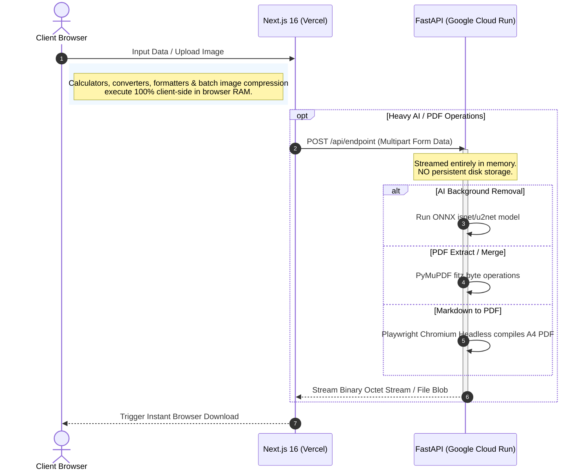

# The Utilify (www.theutilify.com)

[](https://www.theutilify.com)
[](https://www.theutilify.com)
[](https://github.com/vaibhavdeshmukhdeveloper/the-utilify)
[](https://github.com/vaibhavdeshmukhdeveloper/the-utilify)

Welcome to **The Utilify** — a professional-grade, privacy-first, and completely free online suite of 21+ productivity and developer utilities. The application is live at **[theutilify.com](https://www.theutilify.com/)** and is engineered from the ground up to offer lightning-fast, client-side execution, rich interactive UI, and zero persistent file retention.

The platform combines a modern **Next.js 16 (App Router, React 19, TypeScript)** frontend with an asynchronous **FastAPI (Python 3.11)** AI and document compilation backend. Changes pushed to `main` auto-deploy to **Vercel** (frontend) and **Google Cloud** (backend).

---

## 🌟 Key Features & Tools Suite

### 🖼️ Image Utilities
*   **AI Background Remover (`/background-remover`):** Automatically isolates subjects and removes complex backgrounds using multi-model neural networks (`isnet-general-use`, `u2net`, `u2net_human_seg`, `silueta`). Features an interactive **Before/After Comparison Slider**, manual eraser brush, and custom background tinting.
*   **Image Compressor (`/image-compressor`):** Multi-file batch image compressor (PNG, JPG, WebP) running 100% in-browser. Includes live quality sliders, interactive Before/After comparison, individual download buttons, and a **1-click "Download All as ZIP"** export powered by `jszip`.
*   **Color Palette Generator (`/color-palette`):** Create harmonic color schemes (analogous, triadic, monochromatic), check contrast ratios against WCAG 2.1 standards, and export CSS/Tailwind variables.

### 📄 PDF Utilities
*   **PDF to Image (`/pdf-to-image`):** Converts PDF document pages into high-resolution PNG images packed inside a structured `.zip` archive using **PyMuPDF (`fitz`)** rendered at `2x` resolution (~150 DPI).
*   **Split PDF (`/split-pdf`):** Extracts specific pages, ranges, or custom indices (e.g. `1-3, 5, 8-10`) into separate, lightweight PDF files.
*   **Merge PDF (`/merge-pdf`):** Sequentially combines multiple PDF documents of any size into a single, clean document.
*   **Markdown to PDF (`/markdown-to-pdf`):** Converts styled markdown files or raw strings directly into clean A4 PDF documents using headless Chromium rendering.

### 💻 Developer & Text Tools
*   **JSON Formatter (`/json-formatter`):** Prettifies, validates, minifies, and syntax-highlights raw JSON data in real-time with error line highlighting.
*   **Password Generator (`/password-generator`):** Generate cryptographically secure random passwords client-side using Web Crypto APIs with strength indicators.
*   **QR Code Generator (`/qr-generator`):** Create custom high-resolution QR codes for URLs, Wi-Fi networks, emails, SMS, and plain text with color palettes and PNG downloads.
*   **Text Case Converter (`/text-converter`):** Transform text between UPPER, lower, Title, sentence, camelCase, PascalCase, or snake_case with live statistics.
*   **Word Counter (`/word-counter`):** Real-time word, character, sentence, paragraph, reading time, and social media character limit tracking.
*   **Base64 Encoder/Decoder (`/base64`):** Encode plain text or binary files to Base64 format and decode Base64 strings back safely.
*   **Diff Checker (`/diff-checker`):** Compare two chunks of text side-by-side or inline to highlight additions, removals, and character-level edits.
*   **Lorem Ipsum Generator (`/lorem-ipsum`):** Generate customizable placeholder text in paragraphs, sentences, words, or lists with optional HTML wrapper tags.

### 📉 Financial & Utility Calculators (with KaTeX Formulas & Embeds)
*   **SIP Calculator (`/sip-calculator`):** Projects compound returns and wealth accumulation for Systematic Investment Plans with interactive growth charts and rendered LaTeX formula cards ($FV = P \times \left[ \frac{(1+r)^n - 1}{r} \right] \times (1+r)$).
*   **Investment Calculator (`/investment-calculator`):** Simulates long-term wealth growth under initial capital, recurring contributions, compound intervals, and rate of return assumptions with KaTeX mathematical proofs.
*   **BMI Calculator (`/bmi-calculator`):** Calculates Body Mass Index across Metric and US Imperial units with WHO categorizations and formula explanations.
*   **Date Calculator (`/date-calculator`):** Calculate exact calendar duration between dates or add/subtract time intervals.
*   **Age Calculator (`/age-calculator`):** Track precise age with a live seconds ticking counter and countdown to your next birthday.
*   **Unit Converter (`/unit-converter`):** Instant conversion across length, weight, temperature, area, and volume dimensions.

---

## ⚡ UI, UX & SEO Superpowers

1.  **Interactive Above-the-Fold Hero Playground:** Live interactive widget on the homepage for instant QR code generation, password generation, live text transformations, and Base64 conversion without scrolling.
2.  **⭐ Pinned / Favorite Tools System:** Users can star their most frequently used utilities, automatically pinned to the top of the grid and persisted in `localStorage`.
3.  **🎛️ Interactive Before/After Comparison Drag Slider:** Touch-friendly, keyboard-accessible drag slider for Background Remover and Image Compressor.
4.  **📦 Multi-File Batch Processing & ZIP Export:** Process up to 20 images in parallel client-side with 1-click ZIP downloads.
5.  **🎉 Celebratory Micro-Animations:** Lightweight confetti bursts upon copying passwords, calculating financials, or downloading output files.
6.  **🖼️ Dynamic Edge OpenGraph Social Generator (`/api/og`):** Generates high-converting 1200x630 social preview cards for every tool and blog post.
7.  **🔗 Embeddable Calculator Widgets (`/embed/[tool]`):** Standalone embed route providing responsive iframe widgets with canonical backlinks for external websites and blogs.
8.  **📐 E-E-A-T KaTeX Math Formula Cards:** Rendered LaTeX mathematical equations explaining compound interest and health screening formulas.
9.  **🔍 Rich Schema.org Structured Data:** Automatically injects `SoftwareApplication`, `HowTo`, `FAQPage`, `Article`, and `BreadcrumbList` JSON-LD schemas.

---

## 🛡️ Architecture & Philosophy

The Utilify operates under a strict **privacy-first schema**:

1.  **Zero Storage Retention:** Neither the frontend nor the backend databases store user-uploaded images or PDFs. Files sent to Python microservices are processed entirely in RAM streams and destroyed immediately upon returning binary responses.
2.  **Client-Side Computation:** Calculators, converters, formatters, and batch image compression execute 100% locally in browser memory for zero server latency.
3.  **Dockerized Backend Pipelines:** Heavy AI segmentation (ONNX runtime) and Playwright Chromium PDF compilation run on a scale-to-zero Dockerized microservices stack deployed on Google Cloud.



---

## 🛠️ Tech Stack & Dependencies

### Frontend (`/src`)
*   **Framework:** Next.js 16 (React 19 & TypeScript, App Router)
*   **Styling:** Tailwind CSS v4 + custom CSS variables in `src/app/globals.css`
*   **Theme Control:** `next-themes` (Dark/Light mode with glassmorphism navigation)
*   **Icons & UI:** Lucide React, Radix Primitives (`components.json`), `sonner` (Toast notifications)
*   **Math Rendering:** KaTeX (`katex`) for rendered LaTeX equations
*   **Micro-Interactions:** `canvas-confetti` for celebratory action feedback
*   **Archive Packaging:** `jszip` for client-side batch ZIP downloads

### Backend (`/backend`)
*   **Runtime:** Python 3.11
*   **API Framework:** FastAPI & Uvicorn (Asynchronous endpoints)
*   **AI Inference:** `rembg[cpu]` (ONNX Runtime with pre-baked neural network models)
*   **PDF Engine:** PyMuPDF (`fitz`) for fast document manipulation
*   **HTML/MD Rendering Engine:** Playwright Chromium (Headless browser rendering)
*   **Image Processing:** Pillow (`PIL`)

---

## 📂 Project Directory Structure

```text
theutilify/
├── src/                         # Next.js Frontend Application
│   ├── app/                     # App Router pages, layouts, and API routes
│   │   ├── api/                 # Next.js API Routes (Dynamic /api/og generator)
│   │   ├── embed/[tool]/        # Standalone embeddable widget route
│   │   ├── background-remover/  # AI Background Remover (with Before/After Slider)
│   │   ├── image-compressor/    # Batch Image Compressor (with ZIP export)
│   │   ├── pdf-to-image/        # PDF to PNG Image Converter
│   │   ├── split-pdf/           # PDF Splitter & Page Range Extractor
│   │   ├── merge-pdf/           # PDF Merger
│   │   ├── markdown-to-pdf/     # Markdown to PDF Compiler
│   │   ├── sip-calculator/      # SIP Calculator (with KaTeX formulas)
│   │   ├── investment-calculator/# Investment Calculator (with KaTeX formulas)
│   │   ├── bmi-calculator/      # BMI Calculator (with KaTeX formulas)
│   │   ├── json-formatter/      # JSON Prettifier & Validator
│   │   ├── password-generator/  # Secure Password Generator
│   │   ├── qr-generator/        # Custom QR Code Studio
│   │   ├── word-counter/        # Word & Character Counter
│   │   ├── text-converter/      # Text Case Converter
│   │   ├── base64/              # Base64 Encoder/Decoder
│   │   ├── color-palette/       # Color Palette & Contrast Checker
│   │   ├── diff-checker/        # Side-by-side Text Diff Checker
│   │   ├── date-calculator/     # Date Duration Calculator
│   │   ├── age-calculator/      # Live Age & Birthday Countdown
│   │   ├── unit-converter/      # Multi-dimensional Unit Converter
│   │   ├── lorem-ipsum/         # Lorem Ipsum Placeholder Generator
│   │   ├── blog/                # SEO Hub-and-Spoke Comprehensive Guides
│   │   ├── layout.tsx           # Global Root Layout with Providers & Fonts
│   │   └── page.tsx             # Homepage with Hero Playground & Pinned Tools
│   ├── components/              # Reusable React UI Components
│   │   ├── HeroPlayground.tsx   # Instant above-the-fold utility playground
│   │   ├── BeforeAfterSlider.tsx# Interactive Before/After drag slider
│   │   ├── EmbedModal.tsx       # Embeddable iframe code generator
│   │   ├── MathFormula.tsx      # KaTeX LaTeX math formula renderer
│   │   ├── ToolCard.tsx         # Interactive tool card with Pin/Favorite toggle
│   │   ├── ToolsGrid.tsx        # Searchable tools grid with Pinned section
│   │   ├── ToolLayout.tsx       # Standard SEO wrapper layout with Schema.org
│   │   ├── Navbar.tsx           # Glassmorphic navbar with search trigger
│   │   ├── Footer.tsx           # Multi-column footer
│   │   └── CommandPalette.tsx   # Global Cmd+K quick search palette
│   └── lib/                     # Custom helper functions & clients
│       ├── api.ts               # Universal backend upload & file download handler
│       ├── confetti.ts          # Canvas-confetti celebration triggers
│       └── blog-data.ts         # In-depth SEO guides and article registry
│
├── backend/                     # FastAPI Backend Application
│   ├── .u2net/                  # Local cache folder for baked-in AI model weights
│   ├── Dockerfile               # System containerization config (Playwright & AI pre-installation)
│   ├── main.py                  # FastAPI server, endpoints, and processing pipelines
│   └── requirements.txt         # Python application dependencies
```

---

## 🚀 Local Development Setup

### Prerequisites
*   Node.js (v18+)
*   Python (3.10+)

### 1. Backend Setup
```bash
cd backend

# Create & activate virtual environment (Windows PowerShell)
python -m venv venv
.\venv\Scripts\Activate.ps1

# Install dependencies & Playwright Chromium
pip install -r requirements.txt
playwright install --with-deps chromium

# Run backend server (boots on http://localhost:8000)
python main.py
```

### 2. Frontend Setup
```bash
# In the root project directory (theutilify/)
npm install

# Create .env.local
echo "NEXT_PUBLIC_API_URL=http://localhost:8000" > .env.local

# Run development server (boots on http://localhost:3000)
npm run dev
```

---

## 🐳 Docker & Production Deployments

The backend includes a multi-stage `Dockerfile` optimized for serverless container runtimes (Google Cloud Run):

```bash
cd backend
docker build -t theutilify-backend .
docker run -p 8000:8000 theutilify-backend
```

---

## 📜 License

Distributed under the MIT License. See `LICENSE` for more information.

---

*Made with 💻, 🧠, and ⚡ for the open web. Visit the live platform at [theutilify.com](https://www.theutilify.com).*
